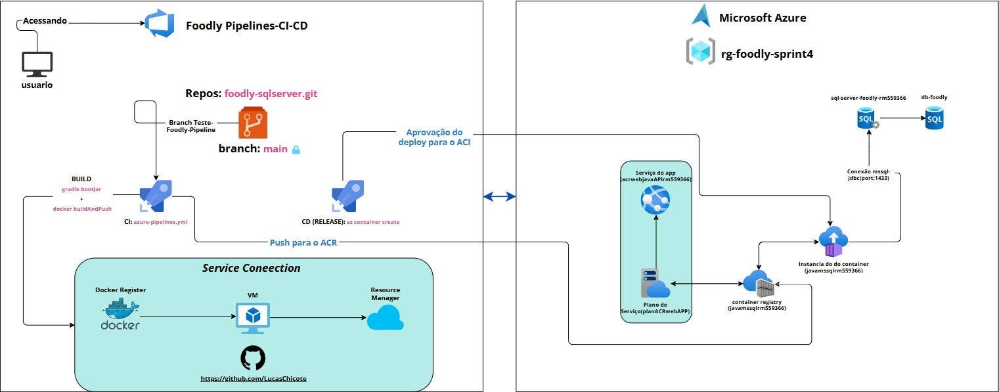

# Foodly API — Pipeline CI/CD & CRUD Azure SQL Server
> **Projeto de DevOps — Pipeline CI/CD automatizada**
> API Spring Boot (Foodly) integrada ao Azure SQL Server, com esteira CI/CD automatizada via Azure DevOps e deploy em nuvem via Azure Container Instances e Web App Services.

---

## Integrantes:
Lucas Aurelio de Brito Chicote → RM 559366
Lucas Gomes de Araujo Lopes → RM 559607
Henrique Marques Sladkevicius → RM 560698.

---

## Link do Projeto no Azure DevOps:
```
https://dev.azure.com/GroupFoodly/Foodly%20Pipelines-CI-CD
```

## Arquitetura da Solução
---




---

---

## Estrutura do Repositório
```
foodly-sqlserver/
├── src/
│   └── main/
│       ├── java/com/foodly/api/
│       │   ├── client/
│       │   │   └── ViaCepClient.java
│       │   ├── config/
│       │   │   ├── GlobalExceptionHandler.java
│       │   │   ├── HttpClientConfig.java
│       │   │   └── SecurityConfig.java
│       │   ├── controller/
│       │   │   ├── AutenticacaoController.java
│       │   │   ├── CategoriaController.java
│       │   │   ├── PedidoController.java
│       │   │   ├── ProdutoController.java
│       │   │   ├── RestauranteController.java
│       │   │   └── UsuarioController.java
│       │   ├── dto/
│       │   ├── model/
│       │   ├── repository/
│       │   ├── security/
│       │   │   └── JwtAuthFilter.java
│       │   └── service/
│       └── resources/
│           ├── db/migration/
│           │   └── V1__criar_tabelas.sql
│           └── application.yaml
├── gradle/wrapper/
├── Dockerfile
├── azure-pipelines.yml
├── build.gradle
└── README.md
```

---

## Arquitetura da Solução

| Camada | Tecnologia |
|--------|-----------|
| Linguagem | Java 17 + Spring Boot 3.4.4 |
| Segurança | Spring Security + JWT |
| Banco de Dados | Azure SQL Server (Microsoft SQL Server) |
| ORM | Hibernate + JPA |
| Migrations | Flyway |
| Container | Docker |
| Registry | Azure Container Registry (ACR) |
| Deploy | Azure Container Instances (ACI) |
| CI/CD | Azure DevOps Pipelines |

---

## Infraestrutura Provisionada

| Recurso | Nome | Região |
|---------|------|--------|
| Resource Group | `rg-foodly-sprint4` | Brazil South |
| Container Registry | `javamssqlrm559366` | Brazil South |
| SQL Server | `sql-server-foodly-rm559366` | Brazil South |
| Banco de Dados | `db-foodly` | Brazil South |
| Container Instance | `javamssqlrm559366` | Brazil South |
| App Service Plan | `planACRWebApp` | Brazil South |
| Web App | `acrwebjavaAPIrm559366` | Brazil South |

---

## Scripts de Automação de Infraestrutura

### setup-recursos.sh — Grupo de Recursos + Azure Container Registry (ACR)

```bash
#!/bin/bash
grupoRecursos=rg-foodly-sprint4
regiao=brazilsouth
rm=rm559366
nomeACR="javamssql$rm"
skuACR=Basic

if [ $(az group exists --name $grupoRecursos) = true ]; then
    echo "O grupo de recursos $grupoRecursos já existe"
else
    az group create --name $grupoRecursos --location $regiao
    echo "Grupo de recursos $grupoRecursos criado na localização $regiao"
fi

if az acr show --name $nomeACR --resource-group $grupoRecursos &> /dev/null; then
    echo "O ACR $nomeACR já existe"
else
    az acr create --resource-group $grupoRecursos --name $nomeACR --sku $skuACR
    echo "ACR $nomeACR criado com sucesso"
    az acr update --name $nomeACR --resource-group $grupoRecursos --admin-enabled true
    echo "Habilitado com sucesso o usuário Administrador para o ACR $nomeACR"
fi

ADMIN_USER=$(az acr credential show --name $nomeACR --query "username" -o tsv)
ADMIN_PASSWORD=$(az acr credential show --name $nomeACR --query "passwords[0].value" -o tsv)

export ACR_ADMIN_USER=$ADMIN_USER
export ACR_ADMIN_PASSWORD=$ADMIN_PASSWORD

echo $ACR_ADMIN_USER
echo $ACR_ADMIN_PASSWORD
```

### Criação do Azure SQL Server e Banco de Dados

```bash
az sql server create \
  --resource-group rg-foodly-sprint4 \
  --name sql-server-foodly-rm559366 \
  --location brazilsouth \
  --admin-user user-foodlysql \
  --admin-password "FoodlyDelivery@2026"

az sql db create \
  --resource-group rg-foodly-sprint4 \
  --server sql-server-foodly-rm559366 \
  --name db-foodly \
  --service-objective Basic

az sql server firewall-rule create \
  --resource-group rg-foodly-sprint4 \
  --server sql-server-foodly-rm559366 \
  --name liberaALL \
  --start-ip-address 0.0.0.0 \
  --end-ip-address 255.255.255.255
```

### DDL das Tabelas (executado via Flyway — V1__criar_tabelas.sql)

```sql
IF NOT EXISTS (SELECT * FROM sysobjects WHERE name='usuarios' AND xtype='U')
CREATE TABLE usuarios (
    id       BIGINT IDENTITY(1,1) PRIMARY KEY,
    nome     VARCHAR(100) NOT NULL,
    email    VARCHAR(150) NOT NULL UNIQUE,
    senha    VARCHAR(255) NOT NULL,
    role     VARCHAR(30)  NOT NULL,
    cep      VARCHAR(10),
    rua      VARCHAR(255),
    bairro   VARCHAR(100),
    cidade   VARCHAR(100),
    uf       VARCHAR(2)
);

IF NOT EXISTS (SELECT * FROM sysobjects WHERE name='restaurantes' AND xtype='U')
CREATE TABLE restaurantes (
    id        BIGINT IDENTITY(1,1) PRIMARY KEY,
    nome      VARCHAR(100) NOT NULL,
    descricao VARCHAR(255),
    categoria VARCHAR(100),
    imagem_url VARCHAR(500),
    dono_id   BIGINT NOT NULL,
    CONSTRAINT fk_restaurante_dono FOREIGN KEY (dono_id) REFERENCES usuarios(id)
);

IF NOT EXISTS (SELECT * FROM sysobjects WHERE name='categorias' AND xtype='U')
CREATE TABLE categorias (
    id   BIGINT IDENTITY(1,1) PRIMARY KEY,
    nome VARCHAR(100) NOT NULL UNIQUE
);

IF NOT EXISTS (SELECT * FROM sysobjects WHERE name='produtos' AND xtype='U')
CREATE TABLE produtos (
    id             BIGINT IDENTITY(1,1) PRIMARY KEY,
    nome           VARCHAR(100) NOT NULL,
    descricao      VARCHAR(255),
    preco          FLOAT NOT NULL,
    imagem_url     VARCHAR(500),
    categoria_id   BIGINT NOT NULL,
    restaurante_id BIGINT NOT NULL,
    CONSTRAINT fk_produto_categoria   FOREIGN KEY (categoria_id)   REFERENCES categorias(id),
    CONSTRAINT fk_produto_restaurante FOREIGN KEY (restaurante_id) REFERENCES restaurantes(id)
);

IF NOT EXISTS (SELECT * FROM sysobjects WHERE name='pedidos' AND xtype='U')
CREATE TABLE pedidos (
    id             BIGINT IDENTITY(1,1) PRIMARY KEY,
    status         VARCHAR(30) NOT NULL,
    total          FLOAT NOT NULL,
    criado_em      DATETIME NOT NULL,
    cliente_id     BIGINT NOT NULL,
    restaurante_id BIGINT NOT NULL,
    CONSTRAINT fk_pedido_cliente      FOREIGN KEY (cliente_id)     REFERENCES usuarios(id),
    CONSTRAINT fk_pedido_restaurante  FOREIGN KEY (restaurante_id) REFERENCES restaurantes(id)
);

IF NOT EXISTS (SELECT * FROM sysobjects WHERE name='itens_pedido' AND xtype='U')
CREATE TABLE itens_pedido (
    id             BIGINT IDENTITY(1,1) PRIMARY KEY,
    quantidade     INT NOT NULL,
    preco_unitario FLOAT NOT NULL,
    pedido_id      BIGINT NOT NULL,
    produto_id     BIGINT NOT NULL,
    CONSTRAINT fk_item_pedido   FOREIGN KEY (pedido_id)  REFERENCES pedidos(id),
    CONSTRAINT fk_item_produto  FOREIGN KEY (produto_id) REFERENCES produtos(id)
);
```

### setup-aci.sh — ACI + Web App Service

```bash
#!/bin/bash
grupoRecursos=rg-foodly-sprint4
rm=rm559366
nomeACR="javamssql$rm"
imageACR="javamssql$rm.azurecr.io/javasql:latest"
serverACR="javamssql$rm.azurecr.io"
userACR=$(az acr credential show --name $nomeACR --query "username" -o tsv)
passACR=$(az acr credential show --name $nomeACR --query "passwords[0].value" -o tsv)
nomeACI="javamssql$rm"
regiao=brazilsouth
planService=planACRWebApp
sku=F1
appName="acrwebjavaAPI$rm"
port=8080

DB_HOST="sql-server-foodly-rm559366.database.windows.net"
DB_NAME="db-foodly"
DB_USER="user-foodlysql"
DB_PASSWORD="FoodlyDelivery@2026"
DB_PORT="1433"

az container create \
    --resource-group $grupoRecursos \
    --name $nomeACI \
    --image $imageACR \
    --cpu 1 \
    --memory 1 \
    --os-type Linux \
    --registry-login-server $serverACR \
    --registry-username $userACR \
    --registry-password $passACR \
    --dns-name-label $nomeACI \
    --restart-policy Always \
    --ports 8080 \
    --environment-variables \
        DB_HOST="$DB_HOST" \
        DB_NAME="$DB_NAME" \
        DB_USER="$DB_USER" \
        DB_PASSWORD="$DB_PASSWORD" \
        DB_PORT="$DB_PORT" \
        PORT="8080"

if az appservice plan show --name $planService --resource-group $grupoRecursos &> /dev/null; then
    echo "O plano de serviço $planService já existe"
else
    az appservice plan create --name $planService --resource-group $grupoRecursos --is-linux --sku $sku
    echo "Plano de serviço $planService criado com sucesso"
fi

if az webapp show --name $appName --resource-group $grupoRecursos &> /dev/null; then
    echo "O Serviço de Aplicativo $appName já existe"
else
    az webapp create --resource-group $grupoRecursos --plan $planService --name $appName --deployment-container-image-name $imageACR
    echo "Serviço de Aplicativo $appName criado com sucesso"
fi

if az webapp show --name $appName --resource-group $grupoRecursos > /dev/null 2>&1; then
    az webapp config appsettings set --resource-group $grupoRecursos --name $appName --settings WEBSITES_PORT=$port
    echo "Serviço de Aplicativo $appName configurado para escutar na porta $port com sucesso"
fi
```

---

## Pipeline CI/CD no Azure DevOps

O ciclo de vida completo foi gerenciado dentro do ecossistema do Azure DevOps:

1. **Azure Boards** — Tasks criadas e acompanhadas até a conclusão.
2. **Branch de feature** — Desenvolvimento realizado na branch `Teste_Foodly_Pipeline`, isolando o trabalho da `main`.
3. **Pull Request** — Abertura, revisão e merge para `main`, disparando automaticamente a trigger de CI.
4. **Pipeline CI** — O arquivo `azure-pipelines.yml` executa o build da imagem Docker e publica no ACR.
5. **Release CD** — A esteira de Release dispara o deploy no ACI e no Web App, com aprovação manual configurada antes do stage de produção.

### azure-pipelines.yml

```yaml
trigger:
  - Teste_Foodly_Pipeline
pool:
  vmImage: ubuntu-latest
stages:
  - stage: Build
    displayName: "Build e Push para ACR"
    jobs:
      - job: BuildAndPush
        steps:
          - task: Docker@2
            displayName: "Build e Push da imagem"
            inputs:
              containerRegistry: "javamssqlrm559366"
              repository:        "javasql"
              command:           "buildAndPush"
              Dockerfile:        "**/Dockerfile"
              tags: |
                $(Build.BuildId)
                latest
  - stage: Deploy
    displayName: "Deploy no ACI"
    dependsOn: Build
    jobs:
      - job: DeployACI
        steps:
          - task: AzureCLI@2
            displayName: "Criar container no ACI"
            inputs:
              azureSubscription: "Azure for Students (09c004c8-b4c2-42ce-bbc2-c91c252995eb)"
              scriptType:        "bash"
              scriptLocation:    "inlineScript"
              inlineScript: |
                az container delete \
                  --resource-group rg-foodly-sprint4 \
                  --name javamssqlrm559366 \
                  --yes || true
                az container create \
                  --resource-group rg-foodly-sprint4 \
                  --name javamssqlrm559366 \
                  --image javamssqlrm559366.azurecr.io/javasql:latest \
                  --cpu 1 \
                  --memory 1 \
                  --os-type Linux \
                  --registry-login-server javamssqlrm559366.azurecr.io \
                  --registry-username javamssqlrm559366 \
                  --registry-password "$(ACR_PASSWORD)" \
                  --dns-name-label javamssqlrm559366 \
                  --restart-policy Always \
                  --ports 8080 \
                  --environment-variables \
                    DB_HOST="sql-server-foodly-rm559366.database.windows.net" \
                    DB_NAME="db-foodly" \
                    DB_USER="$(DB_USER)" \
                    DB_PASSWORD="$(DB_PASSWORD)" \
                    DB_PORT="1433" \
                    PORT="8080"
```

---
## Antes de realizar o CRUD executar esse comando no shell do Portal da Azure

```bash
az acr repository show-tags --name javamssqlrm559366 --repository javasql --orderby time_desc --top 3
```

**Saída**

```
[
  "latest",
  "59",
  "58"
]
```
**Pegar o primeiro numero que aparecer, nesse caso no exemplo seria <59> e substituir no próximo código**

## Recria o container com a tag :59

```bash
az container delete \
  --resource-group rg-foodly-sprint4 \
  --name javamssqlrm559366 \
  --yes || true

az container create \
  --resource-group rg-foodly-sprint4 \
  --name javamssqlrm559366 \
  --image javamssqlrm559366.azurecr.io/javasql:59 \ <-- # INSIRE AQUI A TAG NOVA QUANDO FOR EXECUTAR O COMANDO DE ACHAR AS TAGS  
  --cpu 1 \
  --memory 1 \
  --os-type Linux \
  --registry-login-server javamssqlrm559366.azurecr.io \
  --registry-username javamssqlrm559366 \
  --registry-password "A88FAc800xLYJCELdWi8aQRg4LVoO5GzbmT7YwziomRvshjUyUKwJQQJ99CEACZoyfiEqg7NAAACAZCRACwL" \
  --dns-name-label javamssqlrm559366 \
  --restart-policy Always \
  --ports 8080 \
  --environment-variables \
    DB_HOST="sql-server-foodly-rm559366.database.windows.net" \
    DB_NAME="db-foodly" \
    DB_USER="user-foodlysql" \
    DB_PASSWORD="FoodlyDelivery@2026" \
    DB_PORT="1433" \
    PORT="8080"
```

## URLs da Aplicação em Nuvem

| Ambiente | URL Base |
|----------|----------|
| Azure Container Instances | `http://javamssqlrm559366.brazilsouth.azurecontainer.io:8080` |
| Azure Web App Services | `https://acrwebjavaapirm559366.azurewebsites.net` |

---

## Testes de CRUD via Postman

### Autenticação

#### Cadastrar usuário Admin (Create)
- **Método:** `POST`
- **URL:** `http://javamssqlrm559366.brazilsouth.azurecontainer.io:8080/auth/register`
- **Body:** `raw` → `JSON`
```json
{
  "nome": "Admin Foodly",
  "email": "admin@foodly.com",
  "senha": "123456",
  "role": "ROLE_ADMIN",
  "cep": "04140040"
}
```

#### Login (Obter Token JWT)
- **Método:** `POST`
- **URL:** `http://javamssqlrm559366.brazilsouth.azurecontainer.io:8080/auth/login`
- **Body:** `raw` → `JSON`
```json
{
  "email": "admin@foodly.com",
  "senha": "123456"
}
```
> Copie o token retornado e use como **Bearer Token** no Authorization das próximas requisições.

---

### CRUD de Categorias (requer ROLE_ADMIN)

#### Criar categoria (Create)
- **Método:** `POST`
- **URL:** `http://javamssqlrm559366.brazilsouth.azurecontainer.io:8080/categorias`
- **Authorization:** Bearer Token (admin)
```json
{
  "nome": "Italiana"
}
```

#### Listar categorias (Read)
- **Método:** `GET`
- **URL:** `http://javamssqlrm559366.brazilsouth.azurecontainer.io:8080/categorias`

---

### CRUD de Restaurantes (requer ROLE_RESTAURANT_OWNER)

#### Cadastrar usuário Restaurant Owner
- **Método:** `POST`
- **URL:** `http://javamssqlrm559366.brazilsouth.azurecontainer.io:8080/auth/register`
```json
{
  "nome": "Lucas Chicote",
  "email": "lucas@foodly.com",
  "senha": "123456",
  "role": "ROLE_RESTAURANT_OWNER",
  "cep": "04140040"
}
```

#### Criar restaurante (Create)
- **Método:** `POST`
- **URL:** `http://javamssqlrm559366.brazilsouth.azurecontainer.io:8080/restaurantes`
- **Authorization:** Bearer Token (owner)
```json
{
  "nome": "Restaurante do Lucas",
  "descricao": "Comida italiana artesanal",
  "categoria": "Italiana",
  "imagemUrl": "https://example.com/img.jpg"
}
```

#### Listar restaurantes (Read)
- **Método:** `GET`
- **URL:** `http://javamssqlrm559366.brazilsouth.azurecontainer.io:8080/restaurantes`

---

### CRUD de Produtos (requer ROLE_RESTAURANT_OWNER)

#### Criar produto (Create)
- **Método:** `POST`
- **URL:** `http://javamssqlrm559366.brazilsouth.azurecontainer.io:8080/produtos`
- **Authorization:** Bearer Token (owner)
```json
{
  "nome": "Pizza Margherita",
  "descricao": "Molho e mussarela",
  "preco": 45.90,
  "imagemUrl": "https://example.com/pizza.jpg",
  "categoriaId": 1,
  "restauranteId": 1
}
```

#### Listar produtos (Read)
- **Método:** `GET`
- **URL:** `http://javamssqlrm559366.brazilsouth.azurecontainer.io:8080/produtos`

#### Atualizar produto (Update)
- **Método:** `PUT`
- **URL:** `http://javamssqlrm559366.brazilsouth.azurecontainer.io:8080/produtos/1`
- **Authorization:** Bearer Token (owner)
```json
{
  "nome": "Pizza Margherita Especial",
  "descricao": "Molho, mussarela e azeite",
  "preco": 49.90,
  "imagemUrl": "https://example.com/pizza.jpg",
  "categoriaId": 1,
  "restauranteId": 1
}
```

#### Deletar produto (Delete)
- **Método:** `DELETE`
- **URL:** `http://javamssqlrm559366.brazilsouth.azurecontainer.io:8080/produtos/1`
- **Authorization:** Bearer Token (owner)

---

## Evidência de Persistência no Banco (Azure SQL — Query Editor)

```sql
SELECT * FROM usuarios;
SELECT * FROM categorias;
SELECT * FROM restaurantes;
SELECT * FROM produtos;
```

## Vídeo demonstrativo da Sprint completo

[](https://youtu.be/H7O6foFZDHo?si=1heRqXsrHhU3KGGP)
